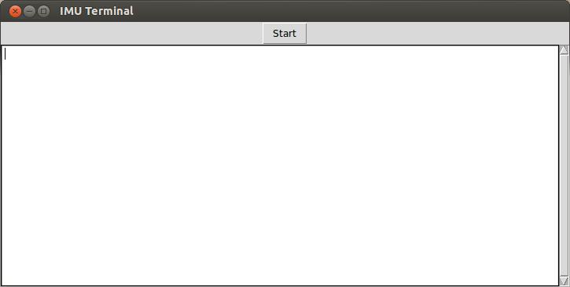
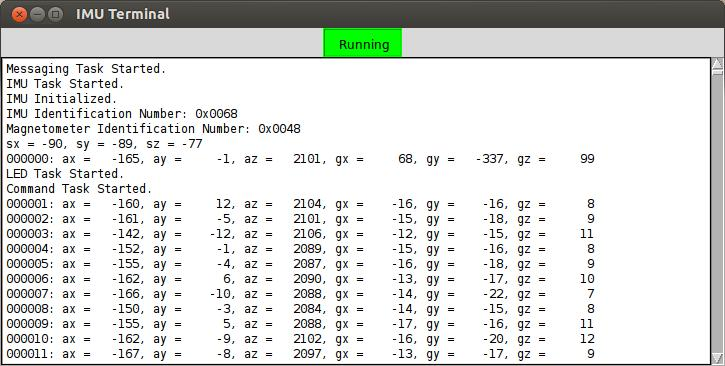
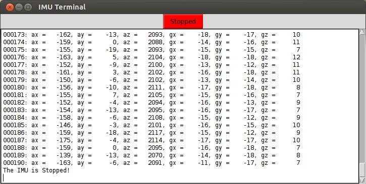
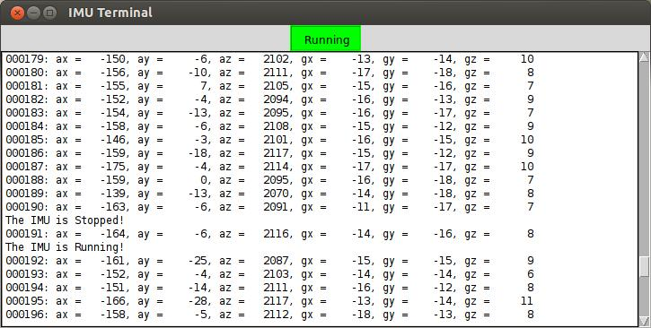

IMU Python GUI
====================

I wanted to create a GUI that I could use to monitor the data that's
coming from the IMU.  I also wanted the ability to send commands to the
IMU from my Netbook while the IMU was mounted in an aircraft.  I decided
to develop my GUI using Python.  I have a little experience in Python,
but not much more than understanding the syntax and the basic structure
of a Python program.  So this project presented itself as a good
opportunity to get more familiar with Python.  I've also done no GUI
development other than in xWindows many years ago and I've hear that GUI
development was very easy in Python.  Another reason is that I wanted
something that would run on either Linux or Windows given that my
development is split between the two platforms.

The GUI has two primary functions.  The first function is to display the
stream of messages that are coming from the IMU and the second function
is to be able to send commands to the IMU.  The first function of
displaying the messages is handled in a tkinter Text widget.  The Text
widget is where all messages coming from the IMU will be displayed.  The
second function of sending commands to the IMU is handled by a single
tkinter Button.  At present, the IMU only accepts two commands; [r|R] to
to place the IMU in Run mode and [s|S] to place the IMU in Stop mode. 
This means that the single Button widget can be used to handle both
commands by toggling its present state and sending the appropriate
command to the UART port for transmission to the IMU.  

When you first start the GUI, it starts comes up as displayed in the
following screen shot.



Along the top of the screen is the Start/Running/Stopped Button.  Below
that is the Text window where all messages will be displayed.

What's happening in the background is that the IMU is sending a stream
of messages through it's USART port to it's xBee module.  The IMU's xBee
module is then transmitting the data through the wireless 802.15.4
transceiver.  The xBee module that's connected to the desktop computer
is then receiving the stream of data at it's 802.15.4 transceiver.  The
transceiver is then converting the data stream back to UART and sending
it to an FTDI module on the adapter board (Sparkfun xBee Explorer USB
[WRL-11812](http://www.sparkfun.com/products/11812)).  The FTDI module
then takes the data and creates a USB package and sending the data to
the USB port on the desktop computer.  The FTDI driver on the desktop
computer (virtual com port) then takes the data and presents it to the
program as if it is a standard UART port.  This is where the Python
program finds the data and then writes the data to the output terminal
window in the GUI as displayed below:



The challenge in the program was how to write the data to the text
window.   The issue is that the GUI is waiting for an event to happen
before it will do anything.  My solution to the issue was simply to have
the monitoring of the UART port handled in a separate thread.  

The handling of the Start/Running/Stopped Button was much easier.  When
the user presses the button, the code simply determines the button's
state and sends the appropriate command, [R|S], to the FTDI virtual com
port.  The FTDI virtual com port then sends the information through the
USB port to the FTDI module on the adapter board which converts the data
to UART and sends it to the xBee 802.15.4 transceiver.  The transceiver
then sends the data through the wireless connection to the xBee module
on the IMU.  The xBee module on the IMU then converts the data back to
USART and sends to to the IMU.  The command task running in the RTOS
will then receive and execute the command.  Pressing the
Start/Running/Stopped Button while the IMU is running will stop the
IMU.  The GUI will then look like this:



Pressing the Button again will cause the IMU to start running as in the
next screen shot.



The reason why there is a line of output prior to the running message is
that the IMU task has higher priority than the command task.  Therefore,
when the IMU is started, it takes control of the CPU immediately.  When
the IMU completes, control is returned to the command task which can
then output the message.

That's it for an explanation of the GUI.  The only remaining detail is
to show you the Python code.  

The code looks like this:
```
#!/usr/bin/python3
 
 from tkinter import *
 import serial
 import time
 import threading
 import sys
 import os
 import glob
 
 class Application(Frame):
     """Build the basic window frame template"""
 
     def __init__(self, master, port):
         super(Application, self).__init__(master)
         self.pack(expand=Y, fill=BOTH)
         self.master.title('IMU Terminal')
         self._create_widgets()
         self.port = port
 
     def _create_widgets(self):
         self.button = Button(self, text = 'Start', command = self._Run_Stop)
         self.button.pack(side = TOP)
         self.button_state = 0
 
         self.text = Text(self, width = 100, height=20, setgrid=True, wrap=WORD,
                 undo=True, pady=2, padx=3)
         self.text.pack(side=LEFT, fill=Y, expand=Y)
         self.scrollbar = Scrollbar(self, command=self.text.yview, orient=VERTICAL)
         self.scrollbar.pack(side = RIGHT, fill = Y)
         self.scrollbar.config(command = self.text.yview)
         self.text.config(yscrollcommand = self.scrollbar.set)
         self.text.focus_set()
 
     def _Run_Stop(self):
         """Event handler for the button"""
         if (self.button_state == 0):
             self.port.write(b'Rr')
             self.button.config(text = 'Running', bg = 'green',
                     relief = SUNKEN, highlightbackground = 'green')
             self.button_state = 1
             #self.display('The IMU is Running!n')
         else:
             self.port.write(b'Sr')
             self.button.config(text = 'Stopped', bg = 'red',
                     relief = RAISED, highlightbackground = 'red')
             self.button_state = 0
             #self.display('The IMU is Stopped!n')
 
     def display(self, output_msg):
         self.text.insert(END, output_msg)
         self.text.yview(END)
 
 
 class DisplayMessages(threading.Thread):
     """Display the messages coming in on the com port in """
     """  the GUI text window.                            """
 
     def __init__(self, port, text_display):
         super().__init__()
         self.port = port
         self.text_display = text_display
 
     def run(self):
         try:
             while True:
                 rcv = self.readlineCR() + b'n'
                 self.text_display(rcv)
         except (RuntimeError):
             print("Caught Thread Exception!n")
 
     def readlineCR(self):
         rv = b''
         while True:
             ch = self.port.read()
             if ch == b'n':
                 return rv
             elif ch < b'x80':
                 rv += ch
 
 def serial_ports():
     """Lists serial ports"""
     if sys.platform.startswith('win'):
         ports = ['COM' + str(i + 1) for i in range(256)]
 
     elif sys.platform.startswith('linux') or sys.platform.startswith('cygwin'):
         # this is to exclude your current terminal "/dev/tty"
         ports = glob.glob('/dev/tty[A-Za-z]*')
 
     elif sys.platform.startswith('darwin'):
         ports = glob.glob('/dev/tty.*')
 
     else:
         raise EnvironmentError('Unsupported platform')
 
     result = []
     for port in ports:
         try:
             s = serial.Serial(port)
             s.close()
             result.append(port)
         except (OSError, serial.SerialException):
             pass
     return result
 
 
 # Start of program
 
 try:
     port_name = sys.argv[1]
 except:
     if (os.name == str('nt')):
         port_name = str('COM13')
     else:
         port_name = str('/dev/ttyUSB0')
 try:
     baudrate = int(sys.argv[2])
 except:
     baudrate = 230400
 
 try:
     port = serial.Serial(port_name, baudrate, timeout=3.0)
     print("Initializing Port {0} with a baud rate of {1}".format(port_name, baudrate))
 except (OSError):
     print("Port {0} is invalid.".format(port_name))
     print("Found Ports:")
     for s in serial_ports():
         print("%s" % s)
     print("Program Terminating.")
     sys.exit()
 
 try:
     root = Tk()
     app = Application(root, port)
     monitor = DisplayMessages(port, app.display)
     monitor.start()
     app.mainloop()
 except:
     print("Caught Main Exception")
```

What amazes me is that the resulting code is so short.  It will also be
very easy to add additional details to the GUI such as adding a file
menu for automating the saving of the data and maybe the addition of a
button to clear the screen.  So in my opinion, choosing Python was a
wise choice for a program like this that doesn't require a lot of
resources.  Python is rather simple to learn and provides a lot of power
with very little coding.  The only drawback is that it is interpreted
and I've never been a fan of interpreted languages going back to the bad
ol' days of basic (as a chill goes up my spine).

The format for running the program is as follows:
```
  ./<program_name>.py <com_port> <baud_rate>
```

For example, this is the command that I use under Linux:
```
 jim@Netbook:~/scripts$ ./imu_terminal.py  /dev/ttyUSB0  9600
```

Under Windows, you need to include the name of the python program as
displayed below:
```
C:scripts>py ./imu_terminal.py  COM12  9600
```

If you want to, you can set the program to use default values for the
com port and for the baud rate.  This is true for both Linux and
Windows.  Just be aware that the name for the com port is different
between the two operating systems.

To be continued...
